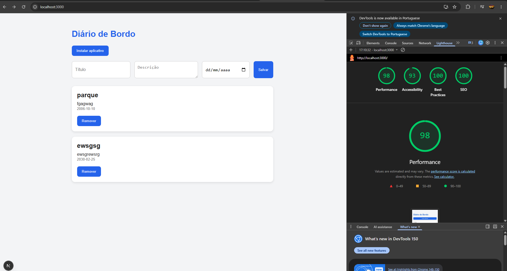
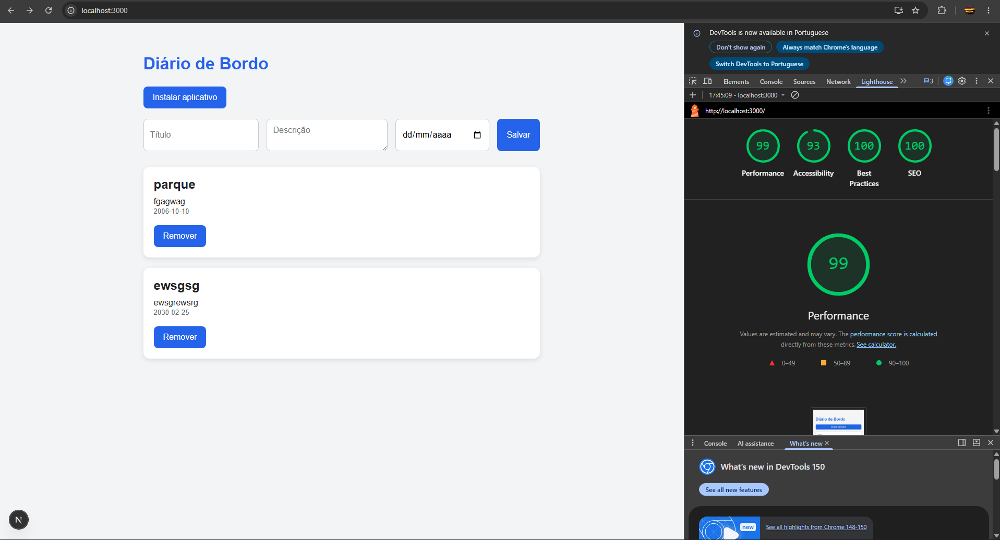

# 📖 Diário de Bordo - Otimização de Performance

Projeto desenvolvido como atividade prática do curso **Desenvolvedor Full Stack Java** da **EBAC**, com foco na análise e otimização de performance utilizando o Google Lighthouse.

---

## 📌 Sobre o projeto

O **Diário de Bordo** é uma aplicação desenvolvida em **Next.js** que permite ao usuário cadastrar, visualizar e remover anotações pessoais. Os dados são armazenados no navegador utilizando **LocalStorage**, permitindo que as informações permaneçam disponíveis mesmo após o fechamento da aplicação.

Este projeto foi utilizado para aplicar técnicas de otimização de performance web utilizando o **Google Lighthouse**, conforme proposto pela atividade da EBAC.

---

## 🚀 Tecnologias utilizadas

- Next.js
- React
- TypeScript
- CSS
- LocalStorage
- Lighthouse (Chrome DevTools)

---

# 📊 Análise Inicial

A análise inicial foi realizada utilizando a ferramenta **Lighthouse** do Google Chrome.

### Resultados

| Métrica | Pontuação |
|----------|----------:|
| Performance | **98** |
| Accessibility | **93** |
| Best Practices | **100** |
| SEO | **100** |

### Gargalos identificados

Apesar da excelente pontuação inicial, foram identificadas algumas oportunidades de melhoria relacionadas à otimização do código:

- Recriação de funções durante as renderizações dos componentes.
- Atualização de estado utilizando valores diretos em vez da atualização funcional recomendada pelo React.
- Pequenas melhorias na organização do CSS.
- Validação de entrada de dados podendo ser aprimorada.

---

# ⚙️ Melhorias aplicadas

Durante a otimização do projeto foram realizadas as seguintes alterações:

## ✔ Otimização de funções

Foi utilizado **useCallback** para memorizar funções passadas como propriedades para componentes filhos, reduzindo recriações desnecessárias durante as renderizações.

---

## ✔ Atualização funcional do estado

As atualizações de estado passaram a utilizar a forma funcional do React:

```tsx
setEntradas((prev) => [...prev, novaEntrada]);
```

Essa abordagem evita problemas relacionados a estados desatualizados e segue as boas práticas recomendadas pelo React.

---

## ✔ Validação dos dados

Foi adicionada validação utilizando `trim()` para impedir o cadastro de entradas contendo apenas espaços em branco.

---

## ✔ Organização do código

Foram realizados pequenos ajustes de organização e padronização do código, melhorando sua legibilidade e manutenção.

---

## ✔ Ajustes no CSS

Pequenas melhorias foram aplicadas ao CSS para tornar o código mais organizado e consistente, mantendo a responsividade da aplicação.

---

# 📈 Resultado Final

Após as otimizações foi realizada uma nova análise utilizando o Lighthouse.

| Métrica | Antes | Depois |
|----------|------:|-------:|
| Performance | **98** | **99** |
| Accessibility | **93** | **93** |
| Best Practices | **100** | **100** |
| SEO | **100** | **100** |

Foi possível obter uma melhora na pontuação de **Performance**, mantendo todas as demais métricas com excelente qualidade.

---

# 📷 Relatórios

## Antes

> Inserir aqui o print do Lighthouse antes das otimizações.



---

## Depois

> Inserir aqui o print do Lighthouse após as otimizações.



---

# ✅ Conclusão

As otimizações aplicadas permitiram melhorar a performance da aplicação sem alterar seu funcionamento.

Além da melhora observada na pontuação do Lighthouse, foram adotadas boas práticas recomendadas para aplicações React e Next.js, como redução de recriações de funções, atualização funcional do estado, validação mais robusta dos dados e organização do código.

O resultado foi uma aplicação mais eficiente, mantendo ótima experiência de uso e elevados índices de qualidade nas métricas avaliadas pelo Lighthouse.

---

# 🔗 Repositório

O código-fonte deste projeto está disponível em:

**GitHub:** https://github.com/ebac-projects-java/diario-de-bordo

---

# 👨‍💻 Autor

Desenvolvido por **Gustavo Lima**.

- GitHub: https://github.com/Limabtw
- LinkedIn: https://www.linkedin.com/in/gustavolima-ti/